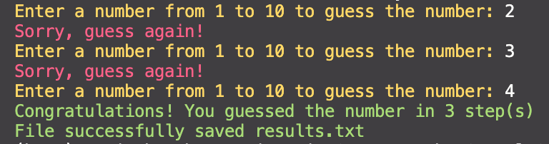

# Guess My Number
## Recursion/Synchronous Implementations 
CLI application

## Game logic:
In this application "Guess the number", the user needs to guess the number from 1 to 10 intended by the program, and in the end, the program will display how many attempts it will take. 

## Built with Node modules 
- readline
- fs
- colors
- commander
- prompt-sync

## Developer experience (Node.js)
- used standart and non-standart Node modules
- practiced creating command-line interface applications 
- practiced handle interactions, including the built-in process object and readline module, which rely on callback functions 
- practiced to handles tasks by running asynchronously
- practiced to use recursion
- practiced to write a syncronous version of the game using Node module

## Recursion implementation
### Game functions:
### Constants:
1. Creaate count for attempts 
2. Create const for saving results 
3. Create const where we save a random number 

### Validation function: 
Check if input is valid number
1. Check if input is a number
2. Check if number is in range from 1 to 10 

### Saving function:
1. Create asynchronous function. We are waiting for the operation to save the results.
It uses the appendFile function of the fs module to write data. 
2. If the file exists, the results will be added to the existing file, if there is no file - it will be created.

### Game function:
1. Inside, a method is called that listens to the console, and when a value is entered, calls a callback function that processes the entered value.
2. All user input will be read as a String, so in order to treat user input as numbers, you’ll need to convert the input.
3. If we do not pass the validation, we start the game function again.
4. If the validation is passed, then we increase the counter of attempts by 1. 
5. Next, we compare the entered value with the secret answer. If the number is guessed, we output the greeting and the number of attempts spent on the game, then using the log function, we save the result in a file, and since the function returns a promise, we close the input interface rl.close() in the finally method.
6. If the result did not match, we execute recursion until the number is guessed.

## Synchronous Implementation 
### Constants:
1. Create const where we save a random number 
2. Create const that is used to determine if the app should continue prompting the user for input.

### Game logic:

1. Check if game should ask a user to enter a number. The while loop loops through a block of code as long as a specified condition is true. 
2. Ask a user to enter a number and get user input using prompt-sync module. 
3. Convert the string input to a number.
4. Compare the guess to the secret answer and let the user know.
5. If user win - change the variable foundCorrectNumber to true and end game.
